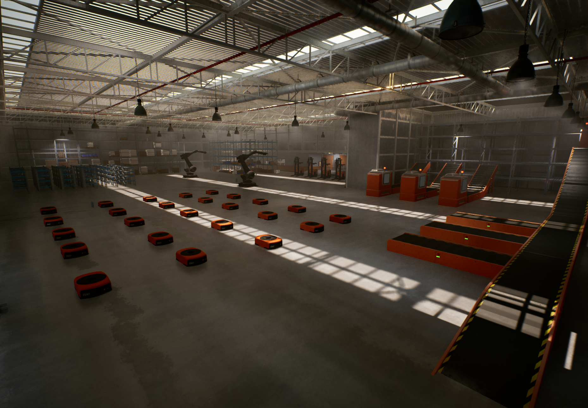

# The RMF Industrial Project

  
  
  

The RMF Industrial project provides RMF services for Manufacturing and Logistics.

## Summary

The RMF Industrial project tries to adopt the new [Next Gen RMF interfaces](https://github.com/open-rmf/next_gen_prototype)
and provides a suite of open source modules for industrial users
to build planning, scheduling and orchestration in large-scale simulated facility,
showcasing RMF’s flexibility, scalability in multi-robot coordination.

## RMF Industrial Modules

| Module Name | Repositories |
| - | - |
| RMF Industrial | <https://github.com/ros-industrial/rmf_industrial> |
| VDA5050 Library and support tools | <https://github.com/ros-industrial/vda5050_core>  <https://github.com/ros-industrial/vda5050_interfaces> |
| Unreal Engine Plugins | <https://github.com/ros-industrial/UERMF2Plugins> |
| MAPF Robot Execution System (RES) | <https://github.com/ros-industrial/res_mapf> |
| Task Orchestrator | <https://github.com/ros-industrial/rmf2_task_orchestrator> |
| Task Scheduler | <https://github.com/ros-industrial/rmf2_scheduler> |
| Web UI | <https://github.com/ros-industrial/rmf2-ui> |

## Demonstrations

<table>
  <thead>
    <tr>
      <th>
        
      </th>
    </tr>
  </thead>
  <tbody>
    <tr>
      <td>
        

          Warehouse Demonstration
          (<a href="https://downloads.rmf-industrial.org/UE5Demos/RMF2_SIM_20260528.zip">Download Link</a>)
        

      </td>
    </tr>
  </tbody>
</table>

### Warehouse Demonstration

coming soon...

## Documentation

- Guides
  - [Install from Source (Ubuntu)](./docs/guide/install-from-source-ubuntu.md)
